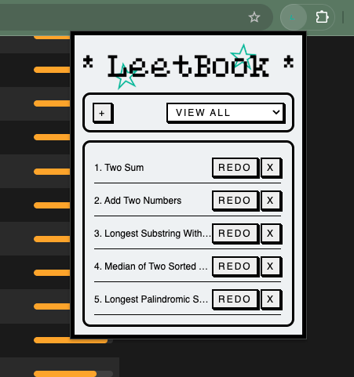

# LeetBook: LeetCode Problems Keeper #

## Description ##
This extension helps users track their progress on LeetCode by saving failed problems and providing an easy way to revisit and redo them.

## Check it out on Chrome Store ##
https://chromewebstore.google.com/detail/leetbook-leetcode-problem/pmlnbpgbcjnmgddjidfkfkcchboncmek

## Instructions ##
1. Add a new problem: open LeetBook and press "+" button on the desired problem's !!!description!!! page, LeetBook will add the problem to the list for you.
2. Navigate to the problem page by pressing the "REDO" button.
3. Delete a problem by pressing "x".
4. Use the dropdown list to view past added problems by topic.
